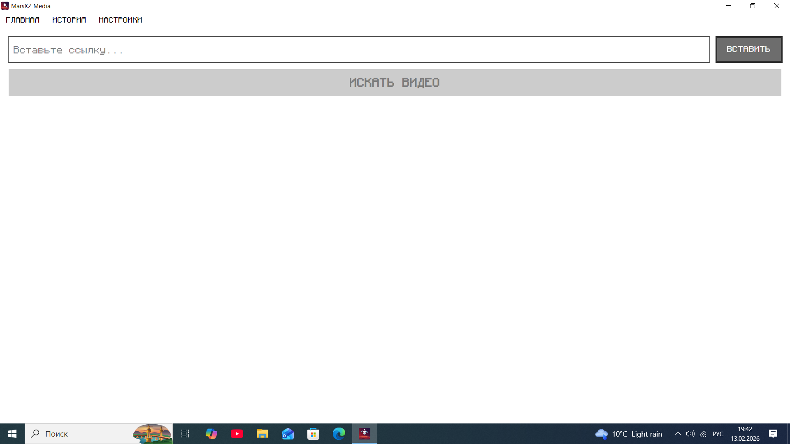
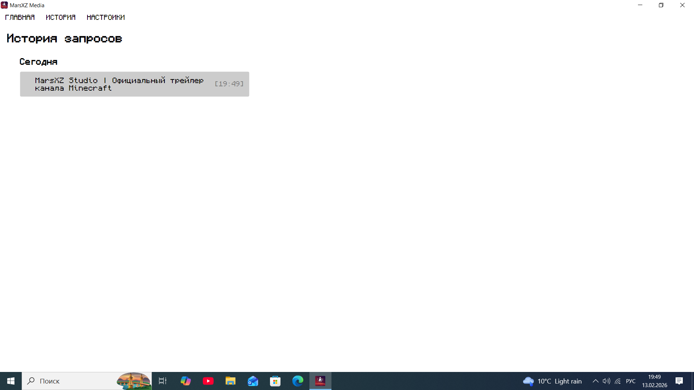
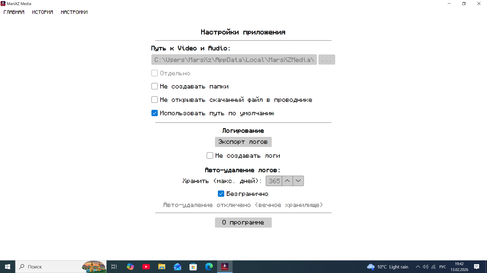
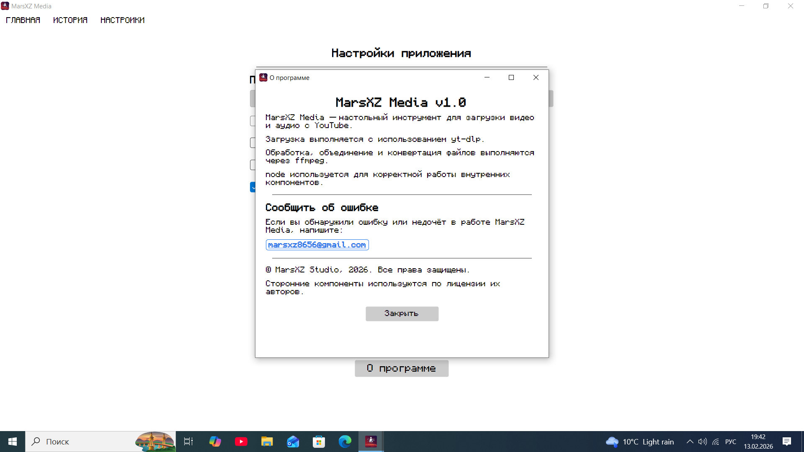

# MarsXZ Media  

MarsXZ Media — настольное приложение для загрузки видео и аудио с YouTube.
Программа предназначена для быстрого и удобного скачивания медиафайлов
с минимальной нагрузкой на систему.

Приложение оптимизировано для слабых ПК и работает как самостоятельный
исполняемый файл без необходимости установки .NET.

---

## 📸 Скриншоты программы

  
  

  
  

---

## 🎥 Поддерживаемые платформы

В текущей версии поддерживается только YouTube.

Разрешённые форматы ссылок:
- https://youtu.be/...
- https://www.youtube.com/...
- https://m.youtube.com/...

Поддержка других платформ планируется в будущих версиях.

---

## Основные возможности

• Загрузка видео с YouTube в формате MP4  
• Извлечение аудио в формате MP3  
• Автоматическое объединение аудио и видео потоков  
• Конвертация через ffmpeg  
• Встроенная система восстановления файлов  
• История загрузок  
• Простое и понятное управление  
• Поддержка слабых систем (x86)

---

## Как это работает

MarsXZ Media использует проверенные инструменты:

- **yt-dlp** — загрузка медиа с YouTube  
- **ffmpeg** — обработка, объединение и конвертация файлов  
- **node** — работа внутренних компонентов приложения  

Если необходимые файлы отсутствуют, программа автоматически
загрузит их и восстановит работоспособность.

---

## Дизайн и стиль

Интерфейс MarsXZ Media вдохновлён визуальным стилем Minecraft.

В приложении используется шрифт Monocraft и звуковые эффекты,
стилизованные под атмосферу игры для создания узнаваемого
пользовательского опыта.

MarsXZ Media не является продуктом Mojang или Microsoft
и не связан с ними. Все права на оригинальные элементы
Minecraft принадлежат их владельцам.

---

## Системные требования

- Windows 10 версии 18362 и выше  
- Архитектура x86  
- ~300 МБ свободного места  
- Интернет-соединение

---

## Установка

1. Скачайте установщик из раздела Releases 
2. Запустите установку
3. Следуйте инструкциям мастера установки
4. Запустите MarsXZ Media

Программа работает без установки .NET.

---

## Поддержка и ошибки

Если вы обнаружили ошибку или недочёт:

📧 marsxz8656@gmail.com

Пожалуйста, укажите:
- версию программы
- описание проблемы
- шаги для воспроизведения

---

## Юридическая информация

MarsXZ Media является инструментом для загрузки медиа.
Пользователь несёт ответственность за соблюдение правил платформы
и авторских прав.

Сторонние компоненты используются по лицензии их авторов.

© MarsXZ Studio
